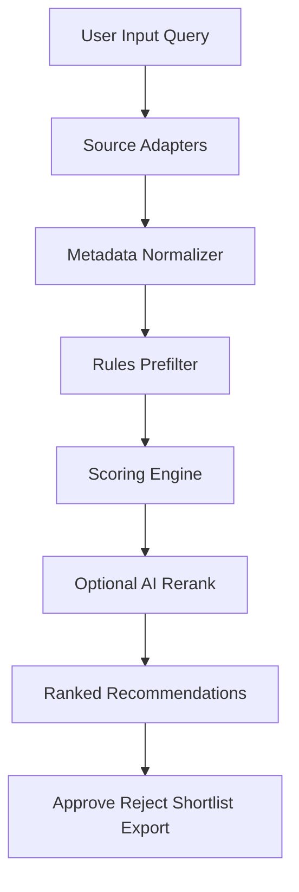
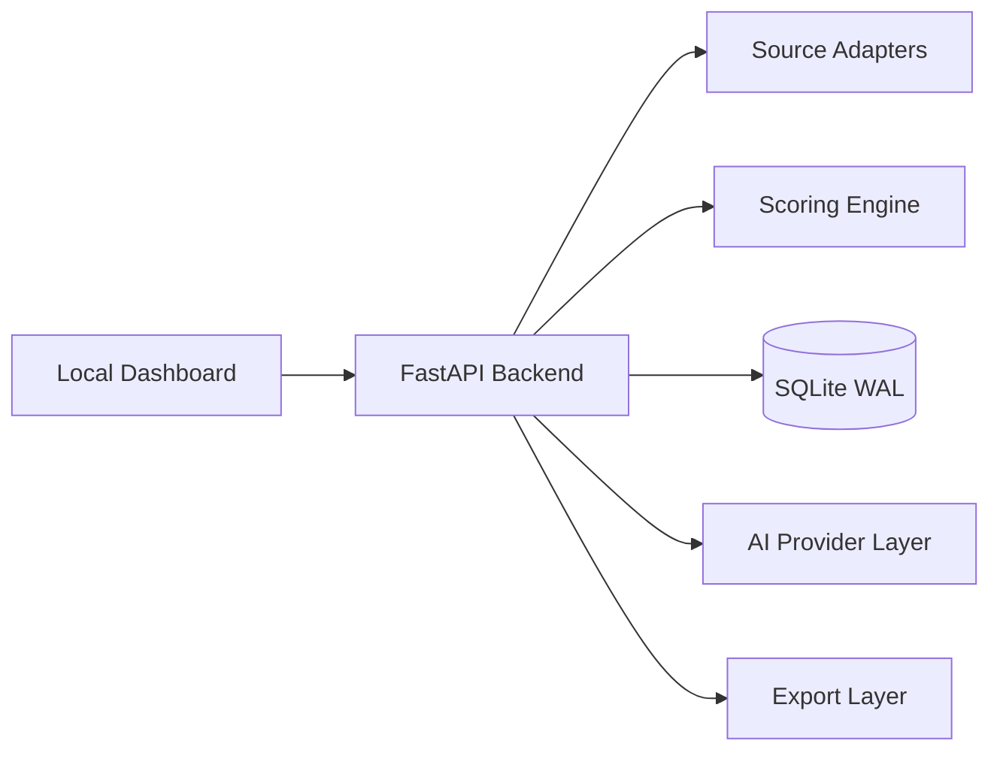

# PRD – RotanFinder

## 1. Executive Summary
RotanFinder adalah aplikasi laptop-first untuk menemukan video lintas platform yang paling layak di-clip menjadi short-form content. Sistem tidak memberi rekomendasi berdasarkan tebakan, tetapi berdasarkan metadata, momentum tren, engagement, sinyal hook, dan scoring yang bisa dijelaskan. Target awalnya adalah content creator, clipper, dan growth operator yang butuh shortlist video potensial tanpa harus manual scroll berjam-jam. MVP difokuskan pada discovery, scoring, ranking, shortlist, dan export. Arsitektur dipilih agar ringan di laptop, murah di token AI, mudah dipahami AI coding agent, dan punya jalur scale-up jika valid secara bisnis.

## 2. Problem Statement
Creator dan clipper menghadapi tiga masalah utama: terlalu banyak konten, terlalu sedikit sinyal yang benar-benar actionable, dan proses riset video yang boros waktu. Konten yang tampak ramai belum tentu cocok di-clip, aman dimonetisasi, atau relevan untuk niche tertentu. Tool generik biasanya hanya menampilkan trending list mentah tanpa menjelaskan mengapa sebuah video layak dipotong, apa sudut clip-nya, dan seberapa aman dipakai ulang. Akibatnya, tim konten sering membuang waktu pada video yang tidak punya hook kuat, tidak monetizable, atau terlambat momentum. RotanFinder memecahkan ini dengan discovery lintas platform, rules-first scoring, reranking opsional berbasis AI, dan output recommendation object yang explainable.

## 3. Business Value & Monetization Rationale
Nilai ekonomi RotanFinder berasal dari percepatan riset konten dan peningkatan hit-rate konten clip yang layak publish. Jika user bisa memangkas waktu riset dari 2-3 jam menjadi <20 menit per batch, ROI langsung terasa. Jika kualitas shortlist naik, peluang view, retention, dan monetisasi ikut naik. Monetization rationale utama:
- creator lebih cepat menemukan bahan konten berpotensi tinggi
- operator bisa memproses lebih banyak niche dengan tim kecil
- shortlist berbasis data mengurangi trial-and-error
- explainability memudahkan keputusan publish vs skip
- sistem bisa berkembang menjadi paid research tool atau internal content intelligence engine

## 4. Goals & Success Metrics
| Metric | Baseline | Target | Timeline | Owner |
|--------|----------|--------|----------|-------|
| Waktu riset manual per batch | 120-180 menit | <20 menit | 30 hari setelah MVP aktif | Founder |
| Ranking generation time per query | - | <15 detik untuk 100 kandidat | Saat MVP launch | Backend Lead |
| Recommendation shortlist CTR internal | 0% | >18% | 30 hari setelah MVP launch | Product Owner |
| Kandidat duplikat per batch | Tidak terukur | <3% | Saat MVP launch | Backend Lead |
| Biaya AI per 100 rekomendasi | - | <$0.50 | Saat MVP launch | AI Ops |
| False-positive recommendation rate | Tidak terukur | <25% | 45 hari setelah MVP | Product Owner |
| Uptime local service | - | >99% selama sesi kerja | Saat MVP launch | Infra Owner |

## 5. Target Users & Personas
### Persona 1 — Solo Clipper
- Tujuan: menemukan video cepat untuk dijadikan short
- Pain: capek browsing manual, sering salah pilih bahan
- Nilai dari produk: shortlist cepat, alasan rekomendasi jelas, risk note langsung kelihatan

### Persona 2 — Growth Operator
- Tujuan: memproses banyak niche dan banyak platform
- Pain: data tercecer, sulit prioritaskan kandidat
- Nilai dari produk: scoring konsisten, bisa compare antar source, export shortlist ke workflow lain

### Persona 3 — Media Researcher
- Tujuan: memantau creator, topik, dan momentum tren
- Pain: terlalu banyak noise, sulit mengukur clip-worthiness
- Nilai dari produk: metadata terstruktur, explanation layer, historical shortlist

## 6. Jobs-to-be-Done
- Saat saya butuh bahan konten, saya ingin sistem menemukan kandidat video terbaik agar saya tidak perlu riset manual lama.
- Saat saya bekerja pada niche tertentu, saya ingin hasil yang relevan niche agar output clip lebih tepat sasaran.
- Saat saya memilih bahan clip, saya ingin tahu alasan dan risiko rekomendasi agar keputusan saya cepat dan aman.
- Saat saya menjalankan batch discovery berulang, saya ingin sistem menghindari duplikasi agar tidak membuang waktu.
- Saat kuota AI terbatas, saya ingin sistem tetap bekerja dengan rules-based ranking agar biaya tetap rendah.

## 7. Product Scope (MVP / Phase 2 / Excluded)
### MVP
- input niche, kata kunci, platform preference, creator watchlist opsional
- source discovery lintas platform prioritas MVP: YouTube, Twitch clips/VOD metadata, Facebook video publik jika metadata bisa diakses, TikTok bila feasible via source adapter
- metadata collection dan transcript collection bila tersedia
- rules-based prefilter
- clip-worthiness scoring
- AI reranking opsional untuk top candidates saja
- shortlist, approve/reject, export CSV/JSON
- local dashboard + API
- logging, caching, de-duplication

### Phase 2
- PostgreSQL + Redis
- scheduled monitoring jobs multi-niche
- team collaboration ringan
- feedback-driven ranking refinement
- lebih banyak source adapters
- provider abstraction AI yang lebih kaya

### Excluded from MVP
- auto video download massal
- auto clipping/editing pipeline
- multi-tenant SaaS penuh
- Kubernetes/microservices
- vector database
- advanced collaboration/role management

## 8. User Workflow / App Flow
1. User input niche, keyword, preferred platforms, durasi target, dan filter monetization risk.
2. Discovery layer mengambil kandidat dari source adapters.
3. Metadata collector menormalkan data ke format internal.
4. Prefilter rules membuang kandidat yang tidak relevan, terlalu lama, terlalu tua, atau berisiko tinggi.
5. Scoring engine memberi score per dimensi.
6. AI reranking hanya dijalankan untuk subset kandidat teratas jika benefit > cost.
7. Sistem menghasilkan ranked recommendation list dengan explanation.
8. User melakukan approve, reject, shortlist, atau export.
9. Feedback user disimpan untuk tuning ranking berikutnya.

## 9. Functional Requirements
**User Story**: As a content creator, I want to submit niche and platform filters, so that the system searches relevant source videos only.

**Acceptance Criteria**:
- Given user is on discovery form, when user submits niche, keywords, and platform filters, then system starts discovery job with those exact filters.
- Given user submits invalid empty input, when user clicks run, then system shows validation error and no discovery job is created.

**User Story**: As a clipper, I want the system to collect normalized metadata from multiple platforms, so that I can compare candidates in one format.

**Acceptance Criteria**:
- Given adapters return raw source metadata, when normalization runs, then system stores a unified internal record with platform, title, URL, duration, engagement, timestamp, and source metadata hash.
- Given one platform adapter fails, when normalization completes, then successful adapters are still persisted and failed adapter is logged with error status.

**User Story**: As a growth operator, I want rules-based prefiltering, so that low-value or risky candidates are removed before expensive ranking.

**Acceptance Criteria**:
- Given candidate records are collected, when prefilter executes, then candidates failing minimum freshness, minimum engagement, or duration suitability thresholds are marked filtered_out with reasons.
- Given duplicate content is detected, when deduplication runs, then only the highest quality canonical candidate remains active for ranking.

**User Story**: As a researcher, I want explainable scoring, so that I know why a candidate is recommended.

**Acceptance Criteria**:
- Given scoring engine processes a candidate, when result is stored, then system saves total score, per-signal breakdown, confidence, and reason summary.
- Given a candidate lacks transcript data, when scoring runs, then transcript-dependent signals are marked unavailable and final score is recalculated without crashing the job.

**User Story**: As a user, I want shortlist and export actions, so that I can move selected candidates into my clipping workflow.

**Acceptance Criteria**:
- Given ranked recommendations are shown, when user clicks shortlist on a candidate, then system persists shortlist status with timestamp and query context.
- Given shortlisted candidates exist, when user exports CSV or JSON, then system generates a valid file with URL, title, platform, score, explanation, and risk note.

**User Story**: As a cost-conscious operator, I want AI reranking to be limited, so that token usage stays low.

**Acceptance Criteria**:
- Given more than 100 candidates exist, when reranking is enabled, then AI is only called for the top prefiltered subset defined by config.
- Given AI quota is exhausted, when reranking is attempted, then system falls back to rules-only ranking and records fallback status in logs.

## 10. Non-Functional Requirements
- Response time query ranking: <15 detik untuk 100 kandidat pada laptop target.
- Local memory target: idle <600MB, batch processing <1.5GB.
- SQLite wajib WAL mode.
- Semua writes harus idempotent untuk menghindari duplikasi.
- Semua adapters wajib timeout dan retry terbatas.
- Semua AI call wajib bisa dimatikan via config.
- Semua logs berbentuk structured JSON line atau format kunci=nilai konsisten.
- Security MVP: local-only access default, optional API token sederhana.
- Maintainability: code modular per adapter, scoring, storage, API, UI.

## 11. Data Sources & Ingestion Strategy
### Primary MVP Sources
- **YouTube**: prioritas tertinggi; kuat untuk metadata, shorts/trending/topical discovery, transcript availability relatif lebih baik.
- **Twitch**: prioritas menengah; cocok untuk clips, stream highlights, creator momentum.
- **Facebook public video**: prioritas menengah-rendah; value ada, tapi akses data lebih rapuh.
- **TikTok**: prioritas conditional; gunakan jika source adapter stabil dan risiko blokir bisa diterima.

### Ingestion Method Strategy
- official APIs digunakan jika stabil dan secara biaya/akses masuk akal
- yt-dlp / metadata extraction digunakan sebagai pragmatic fallback
- setiap source dibungkus dalam adapter modular dengan interface seragam: discover, normalize, hydrate, validate
- ingestion hanya metadata-first; tidak ada mass download video di MVP

### Ingestion Prioritization
- MVP launch: YouTube dulu, lalu Twitch
- MVP+1: Facebook public metadata
- MVP+2: TikTok bila adapter feasible dan maintenance cost masuk akal

## 12. Clip-Worthiness Scoring Framework
Score total = weighted combination dari signal berikut:
- trend velocity: percepatan pertumbuhan view
- views growth rate: pertumbuhan view per unit waktu
- engagement ratio: like/comment/share dibanding view
- comment momentum: intensitas komentar terkini
- freshness: usia konten
- creator momentum: performa kreator belakangan
- short suitability: durasi dan struktur yang cocok untuk clip pendek
- hook strength: sinyal transcript/title/opening yang memancing rasa ingin tahu
- emotional/controversy pull: sinyal emosi, debat, kejutan, atau humor
- monetization safety: brand safety, language risk, topic sensitivity
- niche relevance: cocok dengan niche target query
- repurposing potential: mudah dipotong jadi beberapa angle clip

Bobot awal MVP:
- trend velocity 15%
- views growth 15%
- engagement ratio 12%
- comment momentum 10%
- freshness 8%
- creator momentum 8%
- short suitability 10%
- hook strength 10%
- monetization safety 5%
- niche relevance 5%
- repurposing potential 2%

Bobot bisa dikonfigurasi tapi default harus sederhana dan bisa dijelaskan.

## 13. Recommendation Explainability Model
Setiap output rekomendasi wajib berisi:
- total score
- score breakdown per dimensi
- reason summary 2-4 poin
- monetization note
- risk note
- confidence level: low / medium / high
- clip angle ideas minimal 2

Interpretasi:
- **High confidence**: data signal lengkap, transcript/title cocok, risk rendah
- **Medium confidence**: signal utama kuat tapi ada data yang hilang
- **Low confidence**: signal tidak lengkap atau terlalu noisy

## 14. AI Cost & Token Efficiency Strategy
Prinsip utama: AI bukan default, AI adalah akselerator selektif. Pipeline biaya rendah:
1. discovery dan metadata collection tanpa LLM
2. prefilter rules-based tanpa LLM
3. scoring awal tanpa LLM
4. AI reranking hanya untuk top subset kandidat
5. cache hasil AI berdasarkan metadata hash + query fingerprint

Kapan tidak perlu AI:
- sorting by freshness, views growth, engagement ratio, duration fit
- deduplication
- hard filters untuk niche/platform/durasi/risk

Kapan cukup rules-based:
- query eksplisit dengan niche jelas
- kandidat sedikit dan signal metadata kuat
- quota AI hampir habis

Kapan perlu AI reranking:
- top 10-20 kandidat punya score berdekatan
- butuh membaca hook strength dari transcript/title
- butuh clip angle ideas singkat

Cloud AI vs local AI:
- cloud AI untuk reasoning singkat pada top subset
- local AI hanya untuk klasifikasi ringan jika model lokal terbukti stabil dan murah
- fallback default selalu rules-only

Guardrails:
- budget harian dan per-batch configurable
- hard stop jika biaya per 100 rekomendasi melewati target
- skip AI jika transcript kosong atau kualitas data rendah
- semua hasil AI dicache minimal 24 jam

## 15. Technical Architecture
### Primary MVP Stack — Updated with Laravel 13
- **Backend**: Python 3.11 + FastAPI (for ingestion & scoring logic)
- **API Server**: Laravel 13 (HTTP API, routing, middleware, database abstraction)
- **Frontend**: Next.js 14 App Router + TypeScript + TailwindCSS + shadcn/ui
- **Database**: SQLite WAL mode (primary) atau PostgreSQL jika dibutuhkan later
- **Jobs**: Laravel Queue (Queued Jobs) untuk async tasks
- **API Documentation**: Laravel API Resources + OpenAPI/Swagger
- **Ingestion**: Python FastAPI service (dedicated untuk source adapters + scoring)
- **AI Provider Layer**: abstraction di Laravel middleware atau dedicated service
- **Deployment**: 
  - Laravel: PHP-FPM + nginx (atau native `php artisan serve` untuk MVP local)
  - Python FastAPI: native systemd service
  - Frontend: Node.js standalone mode + systemd
- **Testing**: 
  - Laravel: PHPUnit + pest
  - Frontend: Jest + React Testing Library
- **Logging**: Laravel logs + structured JSON via Monolog

### Why Laravel 13 Selected
- mature framework, excellent ORM (Eloquent)
- built-in API scaffolding (API Resources, routing)
- strong ecosystem (packages, community)
- easy database migrations + seeding
- excellent for rapid MVP
- good separation: Laravel handles API layer, Python handles ML/scoring layer

### Architecture Decision: Python FastAPI + Laravel Split
- **FastAPI (Python)**: handles source discovery, metadata collection, scoring engine, AI provider abstraction
- **Laravel**: handles HTTP API layer, auth, database ORM, request/response formatting, shortlist storage, user preferences
- **Communication**: Laravel calls FastAPI via HTTP (internal service)
- **Rationale**: Python excellent untuk data processing + ML; Laravel excellent untuk web API; clear separation of concerns

### Rejected alternatives for Backend
- **Django instead of Laravel**: rejected karena Laravel lebih ringan untuk MVP, ORM lebih elegant
- **FastAPI only (no Laravel)**: rejected karena direct Python API lacks middleware polish dan auth scaffolding
- **Node.js backend**: rejected karena Python ingestion logic native di Python, NodeJS wrapper would be overkill

### Context7 Documentation Rule (MANDATORY)
Selama implementasi aplikasi, setiap framework, library, SDK, API, atau CLI utama wajib dicek ke Context7 sebelum dipakai untuk:
- setup dan konfigurasi
- syntax/API usage
- version-specific behavior
- migration notes
- library-specific debugging

Ini berlaku WAJIB untuk: 
- Laravel 13 (setup, Eloquent ORM, API Resources, Migrations, Queue)
- FastAPI (async, dependency injection, data validation)
- SQLite/PostgreSQL drivers
- Next.js 14
- shadcn/ui components
- test framework
- provider AI SDK

## 16. System Diagram / Component Diagram




## 17. Data Model / Entity Design
Entitas inti:
- `search_query`: niche, keywords, platforms, filters, created_at
- `source_candidate`: platform record mentah + normalized fields
- `score_record`: score total, breakdown, confidence, reason summary
- `recommendation`: candidate final dengan status active/rejected/shortlisted/exported
- `user_feedback`: approve/reject/shortlist/export note
- `ai_cache`: prompt hash, provider, response summary, expiry

Relasi:
- satu `search_query` punya banyak `source_candidate`
- satu `source_candidate` punya satu atau lebih `score_record`
- satu `recommendation` mereferensikan kandidat dan score aktif
- `user_feedback` mereferensikan recommendation

## 18. Data Contracts (JSON Examples)
### Source Discovery Input
```json
{
  "query_id": "q_20260613_001",
  "niche": "AI tools",
  "keywords": ["AI automation", "AI agent", "workflow"],
  "platforms": ["youtube", "twitch"],
  "max_candidates": 100,
  "duration_seconds_min": 20,
  "duration_seconds_max": 180,
  "ai_rerank_enabled": true,
  "budget_usd_max": 0.25
}
```

### Raw Metadata Record
```json
{
  "source_id": "yt_abc123",
  "platform": "youtube",
  "url": "https://youtube.com/watch?v=abc123",
  "title": "AI Agent Workflow Demo",
  "creator": "ExampleCreator",
  "duration_seconds": 620,
  "views": 240000,
  "likes": 14000,
  "comments": 820,
  "published_at": "2026-06-10T10:00:00Z",
  "transcript_available": true,
  "metadata_hash": "sha256:example"
}
```

### Scored Candidate Record
```json
{
  "candidate_id": "cand_001",
  "total_score": 86.4,
  "confidence": "high",
  "breakdown": {
    "trend_velocity": 14.2,
    "engagement_ratio": 11.4,
    "hook_strength": 9.1,
    "monetization_safety": 4.8
  },
  "reason_summary": ["views growth tinggi", "engagement kuat", "hook jelas"],
  "risk_note": "Perlu review copyright sebelum publish"
}
```

### Final Recommendation Object
```json
{
  "recommendation_id": "rec_001",
  "source_url": "https://youtube.com/watch?v=abc123",
  "platform": "youtube",
  "title": "AI Agent Workflow Demo",
  "score": 86.4,
  "clip_angle_ideas": ["3-step AI automation demo", "before-after workflow speed"],
  "viral_potential": "high",
  "monetization_potential": "medium",
  "confidence": "high",
  "status": "active"
}
```

### Shortlist Export Object
```json
{
  "export_id": "exp_001",
  "format": "csv",
  "items": ["rec_001"],
  "created_at": "2026-06-13T12:00:00Z"
}
```

## 19. Failure Modes & Recovery Plan
### Source/API unavailable
- Symptom: adapter return kosong/error
- Cause: API down, rate limit, auth issue
- Fallback: skip source, lanjut source lain
- Mitigation: retry terbatas, adapter status logging, source health indicator

### Scraper blocked
- Symptom: metadata kosong atau HTTP error berulang
- Cause: anti-bot / rate limit
- Fallback: pause adapter, gunakan official API jika ada
- Mitigation: throttle, random delay, batasi concurrency

### Transcript unavailable
- Symptom: hook scoring kosong
- Cause: transcript tidak ada / gagal parse
- Fallback: pakai title + metadata heuristics
- Mitigation: tandai confidence turun, jangan gagal total

### AI quota exhausted
- Symptom: provider reject request
- Cause: quota/token habis
- Fallback: rules-only ranking
- Mitigation: hard budget cap, cache agresif, rerank subset kecil

### Recommendation quality drop
- Symptom: shortlist banyak false positive
- Cause: bobot scoring tidak akurat
- Fallback: gunakan baseline weight profile
- Mitigation: feedback loop, evaluation batch, tuning berkala

### Duplicate overload
- Symptom: kandidat sama muncul berulang
- Cause: hash/dedup logic lemah
- Fallback: canonical URL + title similarity merge
- Mitigation: unique index + metadata hash + normalized URL

### Noisy ranking
- Symptom: kandidat acak masuk top rank
- Cause: signal berat sebelah
- Fallback: minimum threshold gate sebelum rank final
- Mitigation: confidence scoring + outlier handling

### Local laptop resource exhaustion
- Symptom: RAM/spike CPU tinggi
- Cause: batch terlalu besar
- Fallback: kecilkan batch, nonaktifkan AI rerank
- Mitigation: batch cap, one-job-at-a-time, memory guardrail

## 20. Timeline & Milestones
### Week 1
- setup project structure
- SQLite schema
- FastAPI skeleton
- YouTube adapter v1
- basic dashboard

### Week 2
- Twitch adapter v1
- normalization layer
- prefilter engine
- scoring engine v1
- shortlist + export

### Week 3
- AI reranking optional
- logs + cache + dedup
- feedback actions
- UAT internal

### Week 4
- performance tuning
- documentation cleanup
- MVP acceptance test
- README draft prep

## 21. Build Order / Implementation Sequence
1. project skeleton
2. database schema + repositories
3. source adapter interface
4. YouTube adapter
5. normalization pipeline
6. prefilter engine
7. scoring engine
8. API endpoints
9. dashboard UI
10. shortlist/export
11. AI rerank layer
12. logs/cache/guardrails
13. tests + hardening

MVP ready jika:
- YouTube source stabil
- ranking jalan end-to-end
- shortlist/export jalan
- AI optional fallback aman
- tests inti lulus

## 22. Risks, Constraints & Mitigations
- **Platform volatility** → adapter modular agar satu source rusak tidak mematikan sistem
- **Copyright/reuse ambiguity** → tampilkan risk note, jangan klaim reuse aman otomatis
- **AI cost creep** → rules-first + budget caps
- **Local hardware limit** → batch kecil, SQLite WAL, no heavy infra
- **False confidence** → confidence label + human review wajib

## 23. Testing & Validation Strategy
### Unit Tests
- score calculation
- normalization mapping
- dedup logic
- export generation

### Integration Tests
- query → adapter → normalize → score → rank → shortlist
- fallback rules-only saat AI mati

### Adapter Tests
- valid URL parse
- malformed source response handling
- timeout/retry behavior

### Cost Guardrail Tests
- AI rerank skipped when budget exceeded
- cache hit prevents repeated provider call

### Manual UAT
- 20 query batch di niche berbeda
- review kualitas top 10 hasil
- review export usability

Definisi lulus test MVP:
- end-to-end discovery sampai export berjalan tanpa crash
- AI failure tidak mematikan pipeline
- duplicate suppression bekerja
- response time dan memory target tercapai pada batch target

## 24. Launch Readiness Checklist
- [ ] SQLite WAL aktif
- [ ] YouTube adapter stabil
- [ ] logging aktif
- [ ] dedup aktif
- [ ] export CSV/JSON valid
- [ ] AI budget cap aktif
- [ ] fallback rules-only tervalidasi
- [ ] manual UAT selesai
- [ ] PRD disetujui untuk implementasi

## 25. Post-Launch Documentation Requirement (README + Credits)
Setelah aplikasi selesai dibangun dan lulus test, project wajib memiliki `README.md` berisi:
- penjelasan aplikasi
- fitur inti
- system requirements
- instalasi
- konfigurasi
- cara menjalankan
- cara membaca hasil rekomendasi
- troubleshooting
- keterbatasan
- roadmap singkat
- credits untuk founder, architect/engineer, open-source libraries penting, dan provider/model yang memang relevan

## 26. Technical Decision Log
- **Backend FastAPI** dipilih karena ringan, populer, AI-friendly; Express/Laravel ditolak untuk MVP karena konteks Python ingestion lebih natural.
- **SQLite WAL** dipilih karena single-laptop dan cepat start; PostgreSQL ditolak di MVP karena overhead operasi.
- **Dashboard ringan** dipilih karena validasi produk lebih penting daripada frontend mewah; Next.js disimpan sebagai fallback.
- **Rules-first scoring** dipilih untuk menekan biaya; AI-only ranking ditolak karena mahal dan kurang stabil.
- **Native systemd deployment** dipilih karena lebih ringan daripada Docker pada laptop user.
